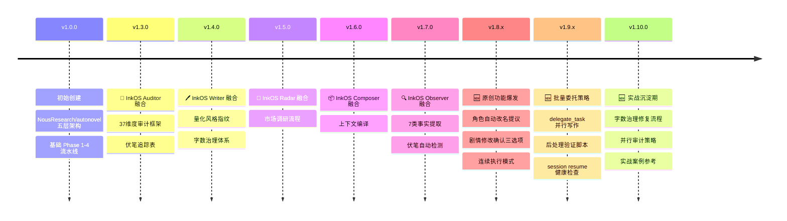

# 🖋️ autonovel-workflow —— 全自动小说创作工作流

> 从一句话灵感种子到完整手稿，全自动流水线。
> 参考 [NousResearch/autonovel](https://github.com/NousResearch/autonovel) 五层协同架构 + InkOS 37-dimension audit 体系，
> 完全基于 Hermes Agent 自身能力实现，无需任何外部 Python 脚本或 API Key。

---

## 📋 目录

- [简介](#-简介)
- [核心架构](#-核心架构)
- [安装指南](#-安装指南)
- [快速上手](#-快速上手)
- [四阶段流水线详解](#-四阶段流水线详解)
- [版本演进史](#-版本演进史)
- [完整文件结构](#-完整文件结构)
- [常见陷阱](#-常见陷阱)
- [FAQ](#-faq)

---

## 📖 简介

`autonovel-workflow` 是一个为 Hermes Agent 设计的小说创作技能。它定义了一套完整、可重复的自动化创作流程，从一句话灵感种子出发，经过：

1. **地基构建** —— 世界观、角色、大纲、叙事声音、硬设数据库 + 雷达市场调研
2. **初稿撰写** —— 逐章写作，每章质量门控 + 编排师上下文编译 + 观察者事实提取
3. **修改循环** —— 37维度对抗式编辑 + 读者评审 + 深度审阅 + 字数治理
4. **导出成品** —— 合并手稿 + 统计报告

最终产出一部结构完整、质量可控的小说手稿。当前版本 **v1.10.0**，经过多轮实战验证（42章/54章年代文项目）。

### 适用场景

- 你有一个灵感种子（一句话 premise），想扩展成完整小说
- 你想要自动化的世界构建 + 角色设计 + 大纲生成流程
- 你写了一版初稿但不知道如何修改，需要对抗式编辑和读者评审
- 你想快速验证一个故事创意的可行性，先跑完地基看看评分

---

## 🏗️ 核心架构

### 五层协同设计 + InkOS 组件融合

```
Layer 5:  voice.md          —— 怎么写（叙事声音、文风调性）
Layer 4:  world.md          —— 什么存在（世界观设定、物理/社会规则）
Layer 3:  characters.md     —— 谁行动（角色档案、动机弧光、关系网）
Layer 2:  outline.md        —— 发生什么（章节大纲、情节 beats）
Layer 1:  chapters/*.md     —— 实际文本（逐章小说正文）
Cross:    canon.md           —— 什么是真的（硬设数据库、不可违背的事实）
```

### 变动双向传播原则

- **向下影响：** 上层变动 → 下层自动调整
- **向上反馈：** 下层写作中发现的设定矛盾 → 更新上层 canon.md

### 评分门控

每个阶段完成时进行质量评分（foundation ≥ 7.5，章节 ≥ 6.0），不达标退回修改，最多 3 轮。

### InkOS 组件融合矩阵

| InkOS 组件 | 融合版本 | 实现位置 |
|:----------|:--------:|:---------|
| **审计员 Auditor** | v1.3.0 | Step 3a.1 — 37维度对抗式编辑（3 worker 并行） |
| **写手 Writer** | v1.4.0 | Step 1.5 — voice.md 量化风格指纹 |
| **字数治理** | v1.4.0 | Step 2.2.4 + Step 3b.2b — 5级偏差处理 |
| **雷达 Radar** | v1.5.0 | Step 1.0 — 市场调研 + 竞争分析 |
| **编排师 Composer** | v1.6.0 | Step 2.1b — 上下文编译（~1000字精简包） |
| **观察者 Observer** | v1.7.0 | Step 2.2b — 7类事实提取 + 伏笔自动检测 |

---

## 🔧 安装指南

### 前置条件

| 条件 | 说明 |
|------|------|
| Hermes Agent | 已安装并配置好模型/提供商 |
| 工具集 | `hermes tools enable file` |
| Context 窗口 | 建议 ≥ 32K tokens（长篇 ≥ 128K） |
| 可选工具 | `delegate_task`（读者小组评审 / 批量写作） |

### 安装方法

```bash
# 从 zip 安装（推荐）
unzip -o autonovel-workflow.zip -d ~/.hermes/skills/

# 验证
hermes skills list | grep autonovel
```

### 加载技能

```
/skill autonovel-workflow
```

---

## 🚀 快速上手

1. **加载技能：** `/skill autonovel-workflow`
2. **给出种子：** 一句话故事 premise
3. **自动构建：** 生成 world.md / characters.md / outline.md / voice.md / canon.md
4. **评分通过：** foundation_score ≥ 7.5 进入初稿
5. **逐章写作：** 每章质量门控 + 实时字数治理
6. **修改循环：** 对抗式编辑 → 读者评审 → 深度审阅
7. **导出成品：** manuscript.md + manuscript-stats.md

---

## 📝 四阶段流水线详解

### Phase 1：地基构建（Foundation）

| Step | 产出 | 融合组件 |
|:----|:-----|:--------:|
| 1.0 雷达市场调研 | `radar/radar-report.md` | 📡 Radar |
| 1.1 种子概念 | — | — |
| 1.2 世界设定 | `foundation/world.md` | — |
| 1.3 角色档案（含自动改名提议） | `foundation/characters.md` | 🆕 原创 |
| 1.4 章节大纲 | `foundation/outline.md` | — |
| 1.5 叙事声音（量化风格指纹） | `foundation/voice.md` | 🖊️ Writer |
| 1.6 硬设数据库（含伏笔追踪表） | `foundation/canon.md` | — |
| 1.7 评分门控 | `foundation/scores.md` | — |

### Phase 2：初稿（First Draft）

| Step | 产出 | 融合组件 |
|:----|:-----|:--------:|
| 2.0 准备工作 | `state.json` / `chapters/` / `runtime/` | — |
| 2.1b 编排师上下文编译 | `runtime/ch_NN/context.md` | 📦 Composer |
| 2.2 逐章撰写（字数治理） | `chapters/ch_NN.md` | 🖊️ Writer |
| 2.2a 批量委托（≥20章） | 多篇章节并行 | 🆕 原创 |
| 2.2b 观察者事实提取 + 伏笔检测 | `runtime/character-registry.md` / update canon.md | 🔍 Observer |
| 2.3 章节间一致性检查 | 更新 canon.md | — |

### Phase 3：修改循环（Revision）

#### Phase 3a：自动化修改

| 步骤 | 产出 |
|:----|:-----|
| 3a.1 对抗式编辑（37维度，3 worker 并行） | `revision/editorial-notes.md` |
| 3a.2 读者小组评审（4人格并行） | `revision/reader-reviews.md` |
| 3a.3 修改简报（优先级排序） | `revision/revision-brief.md` |
| 3a.4 逐条重写 | 更新章节 |
| 3a.5 全局角色改名（全名/裸称替换） | 更新全部文件 |

#### Phase 3b：深度审阅循环

| 步骤 | 产出 |
|:----|:-----|
| 3b.0 剧情修改确认（clarify三选项） | 用户确认 |
| 3b.1 合并完整手稿 | `manuscript-draft.md` |
| 3b.2 双人格深度审阅 | `revision/deep-review.md` |
| 3b.2b 字数治理修复 | `revision/word-governance-report.md` |
| 3b.3 逐个修复循环（连续执行模式） | `revision/fix-log.md` |

### Phase 4：导出（Export）

- 合并最终手稿 → `manuscript.md`
- 输出统计报告 → `manuscript-stats.md`
- 可选：epub 导出 / 封面文案 / 角色关系图谱

---

## 📜 版本演进史

本技能从 v1.0.0 初始版本发展至 v1.10.0，经历了多轮 InkOS 组件融合和原创功能开发。

### 版本时序



### 各版本详细说明

#### v1.0.0 — 初始版（2026-05-27）

**核心能力：**
- 参考 NousResearch/autonovel 五层协同架构（voice/world/characters/outline/chapters + canon）
- 四阶段流水线：Foundation → Draft → Revision → Export
- 评分门控机制：foundation_score ≥ 7.5 准入，章节自评 ≥ 6.0
- 基础模板：world.md / characters.md / outline.md / canon.md
- 反模式检测：anti-patterns.md / anti-slop.md

**文件数：** 8（SKILL.md + README.md + 4 templates + 2 references）
**SKILL.md 字数：** ~22,000 字

---

#### v1.3.0 — InkOS Auditor 融合 🔴（2026-06-04）

**新增能力：**
- 37维度对抗式审计框架（V1-V37），从格式化表格升级为实时扫描
- 伏笔追踪表（pending_hooks）：🟢已回收 / 🟡待回收 / 🔴逾期未收 / ⚪艺术留白 四态
- 输出五层分级：🔴硬伤 → 🟡角色 → 🟢结构 → 📌套路 → 🔍小问题
- 输出格式从重复的维度编号改为分层聚合，每层标题 + 具体问题

**新增文件：** adversarial-review-framework.md（~8,800 字 37 维度框架）

---

#### v1.4.0 — InkOS Writer 融合 🖊️（2026-06-08）

**新增能力：**
- voice.md 量化风格指纹：句长分布 / 段落密度 / 对话占比 / 高频字 / 禁忌词
- 字数治理体系（InkOS 保守写原则）：5级偏差处理 + `--words N` 覆盖
- scripts/style-fingerprint.py 文风量化脚本
- templates/voice.md 模板（含量化模板字段）

**新增文件：** scripts/style-fingerprint.py, references/word-governance.md, templates/voice.md

---

#### v1.5.0 — InkOS Radar 融合 📡（2026-06-10）

**新增能力：**
- Step 1.0 雷达市场调研：种子概念 → 类型定位 → 市场扫描 → 竞争分析 → 差异化机会
- web_search 自动搜索同类作品 + 抽取读者槽点
- references/radar-report-template.md 完整报告模板

**新增文件：** references/radar-report-template.md

---

#### v1.6.0 — InkOS Composer 融合 📦（2026-06-12）

**新增能力：**
- Step 2.1b 编排师上下文编译：纯文件读取生成约1000字精简上下文包
- 写手只需读 context.md 即可开始写作，不需要每章重读全量 foundation
- canon_stale 缓存失效标记：foundation 变动时自动标记，Composer 自动重读
- templates/context-pack.md 上下文包模板（must do / must avoid 清单）

**新增文件：** templates/context-pack.md

---

#### v1.7.0 — InkOS Observer 融合 🔍（2026-06-13）

**新增能力：**
- Step 2.2b 观察者 7 类事实提取：新角色 / 时间 / 地点 / 财物 / 系统 / 关系 / 伏笔
- 伏笔自动检测：每写完一章即扫描新埋伏笔，追加到 pending_hooks
- templates/character-registry.md 角色出场登记表
- conservative update 原则：硬事实写入 canon.md，软信息只记到 register

**新增文件：** templates/character-registry.md

---

#### v1.8.x — 原创功能爆发期 🆕（2026-06-14 ~ 2026-06-16）

**新增能力（InkOS 无等价物）：**
- **角色自动改名提议**（Step 1.3a）：AI 检测角色名是否套路化/撞名/时代错位，clarify三选项确认
- **年代特征审查**：七零/八零/九零年代命名特征表
- **剧情修改确认**（Step 3b.0）：改前展示修改计划，clarify 三选项（全部/选择性/暂不）
- **连续执行模式**：修复中发现新问题不打断，记入 fix-log 统一汇报

---

#### v1.9.x — 批量委托策略落地 🆕（2026-06-17 ~ 2026-06-24）

**新增能力（InkOS 无等价物）：**
- **delegate_task 并行写作**：每片 ≤ 10 章，54 章 2 轮完成
- **后处理验证脚本**：禁用词 / 加粗 / 字数 / 句式 四重验证
- **session resume 健康检查**：文件系统 vs state.json 自动同步
- **超时误判处理**：delegate_task 600s 超时 ≠ 文件丢失

**新增文件：** references/batch-delegation-benchmark.md（54章实测基准数据）

---

#### v1.10.0 — 实战沉淀期 🏆（2026-06-25 ~ 至今）

**新增能力：**
- **字数治理修复流程**（Step 3b.2b）：深改前先治理字数偏差，生成治理报告
- **33→37 维度修正**：修复第三方 SKILL.md 缓存导致的维度错误
- **并行审计策略**：3 worker 分组审计 37 维度（A: 系统设定+细节/B: 角色/C: 结构+创造）
- **style-cleanup-protocol.md**：加粗削减 / 禁用词清零 / 章节扩展 三类修复流程
- **adversarial-review-case-study.md**：42章年代文完整审查实战案例（14个问题 / 5类高频修复模式）
- **实战经验教训文档化**：version-history.md 完整记录每个版本的已知问题和教训

**新增文件：** references/style-cleanup-protocol.md, references/adversarial-review-case-study.md, references/inkos-fusion-pattern.md, references/version-history.md

---

### 版本升级路径

| 版本 | 核心变化 | 升级影响 |
|:----|:---------|:---------|
| v1.0.0 → v1.3.0 | Auditor 融合 | 新增 references/adversarial-review-framework.md |
| v1.3.0 → v1.4.0 | Writer 融合 | 新增 voice.md 量化模板 + scripts/ + word-governance.md |
| v1.4.0 → v1.5.0 | Radar 融合 | 新增雷达报告模板（可选流程） |
| v1.5.0 → v1.6.0 | Composer 融合 | 新增 runtime/ 目录和上下文编译流程 |
| v1.6.0 → v1.7.0 | Observer 融合 | 新增 character-registry.md + 伏笔自动检测 |
| v1.7.0 → v1.8.x | 原创功能 | 新增改名提议 + 修改确认 + 连续执行 |
| v1.8.x → v1.9.x | 批量委托 | 新增 delegate_task 并行 + 验证脚本 |
| v1.9.x → v1.10.0 | 实战沉淀 | 新增案例文档 + 并行审计 + 字数治理修复 |

---

### 实战教训总结

| 教训 | 版本出现 | 根因 | 修复 |
|:----|:--------:|:-----|:-----|
| 33→37 维度不匹配 | v1.10.0 | 引用第三方 SKILL.md 缓存而非上游 README | 上游 README 优先原则 |
| delegate_task 超时误判 | v1.9.x | 600s 限制在汇报阶段触发，文件已写入 | 超时后确认文件存在再决定是否重试 |
| state.json 与实际文件不同步 | v1.9.x | 多轮修改后未更新 state | session resume 时自动遍历恢复 |
| read_file 行号前缀写入损坏 | v1.8.x | 显示输出直接传给 write_file | 先 strip 行号前缀再写入 |

---

## 📂 完整文件结构

### 技能本身（Hermes 技能目录）

```
~/.hermes/skills/creative/autonovel-workflow/
├── SKILL.md                        # 主技能文档（v1.10.0，~63KB）
├── README.md                       # 本文件（项目说明 + 版本演进史）
├── references/                     # 参考文档（10 个文件）
│   ├── version-history.md          #   版本沿革完整记录
│   ├── adversarial-review-framework.md   #   37维度审计框架
│   ├── adversarial-review-case-study.md  #   42章年代文实战案例
│   ├── batch-delegation-benchmark.md     #   54章批量委托基准数据
│   ├── style-cleanup-protocol.md         #   文风清理协议
│   ├── inkos-fusion-pattern.md           #   InkOS 融合模式指南
│   ├── anti-patterns.md                  #   结构套路检测
│   ├── anti-slop.md                      #   文风反注水清单
│   ├── radar-report-template.md          #   雷达报告模板
│   └── word-governance.md                #   字数治理详细说明
├── templates/                      # 模板文件（7 个）
│   ├── world.md / characters.md / outline.md / voice.md / canon.md
│   ├── character-registry.md / context-pack.md
└── scripts/
    └── style-fingerprint.py        # 文风量化分析脚本
```

### 项目运行时（小说创作目录）

```
~/novels/<小说名称>/
├── foundation/                     # 地基文件
│   ├── world.md / characters.md / outline.md / voice.md / canon.md / scores.md
├── radar/                          # 市场调研报告
│   └── radar-report.md
├── chapters/                       # 小说正文
│   ├── ch_01.md / ch_02.md / ...
├── runtime/                        # 运行时缓存
│   ├── ch_NN/context.md + character-registry.md
├── revision/                       # 修改记录
│   ├── editorial-notes.md / reader-reviews.md / revision-brief.md / deep-review.md / fix-log.md
│   └── word-governance-report.md
├── manuscript.md                   # 最终合并手稿
├── manuscript-stats.md             # 手稿统计
└── state.json                      # 写作状态
```

---

## ⚠️ 常见陷阱

| # | 陷阱 | 后果 | 解决 |
|---|------|------|------|
| 1 | 地基不够就开写 | 设定矛盾/角色平庸 | 严格执行评分门控 ≥ 7.5 |
| 2 | 评分走过场 | 低质章节累积 | 自评时诚实问自己 |
| 3 | 过度修改 | 作品失去生气 | 无明显缺陷 ≥ 90% 退出 |
| 4 | 忽视向上反馈 | 设定矛盾积压 | 每3章一致性检查 |
| 5 | 声音漂移 | 首尾像两人写的 | 写前重读 voice.md |
| 6 | 章节过短/过长 | 节奏失控 | 字数治理 2000-3500 字/章 |
| 7 | 角色不一致 | 读者失去代入感 | 写前重读角色档案 |
| 8 | state.json 不同步 | 进度数据丢失 | session resume 自动修复 |
| 9 | delegate_task 超时误判 | 重复工作 | 先确认文件存在 |
| 10 | 忘记更新 manuscript-stats | 进度报告过时 | 每次 Phase 边界更新 |

---

## ❓ FAQ

**Q：需要 API Key 吗？**
A：不需要。完全基于 Hermes Agent 自身能力。

**Q：最多能写多长？**
A：取决于 context window。32K+ 用于中篇，128K+ 用于长篇。

**Q：可以中途手动修改吗？**
A：可以！所有文件都是标准 markdown。修改后继续运行即可。

**Q：AI 味很重怎么办？**
A：本技能自带 anti-slop.md 和 anti-patterns.md 检测清单。也可搭配 `humanizer` 技能使用。

**Q：有实战案例吗？**
A：有！`references/adversarial-review-case-study.md` 记录了 42 章年代文完整审查实战，`references/batch-delegation-benchmark.md` 记录了 54 章并行写作基准数据。

---

## 📄 文件信息

| 项目 | 说明 |
|------|------|
| 当前版本 | **v1.10.0** |
| 迭代次数 | 9 个版本（v1.0.0 → v1.10.0） |
| InkOS 组件融合 | 6 个（Auditor / Writer / Radar / Composer / Observer / 字数治理） |
| 原创功能 | 8 个（改名提议 / 年代审查 / 修改确认 / 连续执行 / 批量委托 / 后处理验证 / session resume / 评分门控） |
| 总文件数 | 20（含 SKILL.md / README.md / 10 references / 7 templates / 1 script） |
| SKILL.md 字数 | ~63,000 字 |
| 作者 | Hermes Agent |
| 协议 | MIT |
| 分类 | creative（创意写作） |
| 标签 | novel, writing, fiction, worldbuilding, character-design, outline, revision, editing, inkos-fusion |

---

*由 autonovel-workflow 自动生成 · 版本演进记录详见 `references/version-history.md`*
