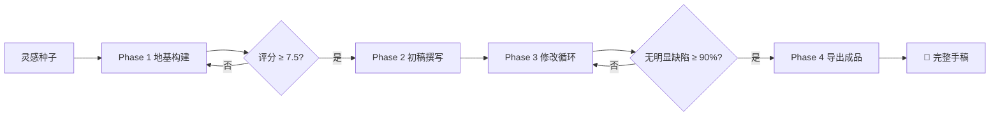
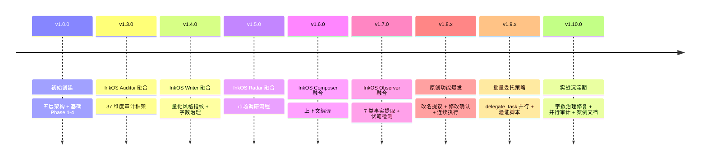

# autonovel-workflow —— 全自动小说创作工作流

> **从一句话灵感种子到完整手稿，全自动流水线。**
>
> 融合 [NousResearch/autonovel](https://github.com/NousResearch/autonovel) 五层协同架构 + InkOS 37 维度审计体系，完全基于 Hermes Agent 自身能力实现，无需任何外部 Python 脚本或 API Key。

- **版本**: v1.10.0
- **协议**: MIT
- **分类**: creative（创意写作）
- **关联技能**: `humanizer` · `writing-plans` · `analyzebook`
- **Stars**: 🌟 20+ (GitHub)
- **实战验证**: 42章 / 54章 长篇年代文项目

---

> 💡 **零外部依赖** — 不需要 Python 脚本、不需要 API Key、不需要第三方服务。只需要 Hermes Agent + 你的灵感种子。

---

## 目录

- [快速开始](#快速开始)
- [核心架构](#核心架构)
- [四阶段流水线](#四阶段流水线)
- [InkOS 融合矩阵](#inkos-融合矩阵)
- [原创功能](#原创功能)
- [安装指南](#安装指南)
- [使用场景](#使用场景)
- [文件结构](#文件结构)
- [常见陷阱](#常见陷阱)
- [版本演进](#版本演进)
- [FAQ](#faq)

---

## 快速开始

### 安装

```bash
# 从 zip 安装（推荐）
unzip -o autonovel-workflow-v1.10.0.zip -d ~/.hermes/skills/

# 验证安装
hermes skills list | grep autonovel

# 在 Hermes 对话中刷新
/reload-skills
```

### 加载技能

在 Hermes 对话中执行：

```
/skill autonovel-workflow
```

### 一句话开始写作

给出你的灵感种子，例如：

> 「一个在数据废墟中苏醒的 AI，误以为自己是人类考古学家，开始挖掘'人类文明'的遗迹——而它自己就是那个文明最后的遗物。」

剩下的交给流水线。它会自动完成：



---

## 核心架构

### 五层协同设计

小说创作不是线性填表，而是多层面板同时运转的信息流。五层由抽象到具体：

```
Layer 5:  voice.md          —— 怎么写（叙事声音、文风调性）
Layer 4:  world.md          —— 什么存在（世界观设定、物理/社会规则）
Layer 3:  characters.md     —— 谁行动（角色档案、动机弧光、关系网）
Layer 2:  outline.md        —— 发生什么（章节大纲、情节 beats）
Layer 1:  chapters/*.md     —— 实际文本（逐章小说正文）
Cross:    canon.md           —— 什么是真的（硬设数据库、不可违背的事实）
```

### 变动双向传播原则

| 方向 | 含义 | 示例 |
|:----|:----|:-----|
| 🔽 **向下影响** | 上层变动 → 下层自动调整 | 修改世界观 → 重写相关章节的对话 |
| 🔼 **向上反馈** | 下层发现矛盾 → 更新上层 | 写作中发现设定矛盾 → 更新 canon.md |

### 评分门控

每个阶段完成时进行质量评分，不达标退回修改（最多 3 轮），防止有缺陷的根基影响后续工作：

| 阶段 | 门控分数 | 重试次数 |
|:----|:--------:|:--------:|
| Phase 1 地基 | ≥ 7.5/10 | 最多 3 轮 |
| Phase 2 每章 | ≥ 6.0/10 | 最多 3 次 |
| Phase 3 深度审阅 | 无明显缺陷 ≥ 90% | 自动退出 |

---

## 四阶段流水线

### Phase 1：地基构建（Foundation）

**目标：** 从种子概念出发，构建完整的五层设定体系。

| Step | 产出文件 | 融合组件 | 说明 |
|:----|:---------|:--------:|:-----|
| 1.0 | `radar/radar-report.md` | 📡 Radar | 雷达市场调研：扫描同类作品 + 竞争分析 |
| 1.1 | — | — | 用户提供灵感种子（一句话 premise） |
| 1.2 | `foundation/world.md` | — | 世界观总览、物理法则、社会结构、地理生态、历史脉络 |
| 1.3 | `foundation/characters.md` | 🆕 | 角色欲望/恐惧/弧光/关系网络 + **自动改名提议** |
| 1.4 | `foundation/outline.md` | — | 三幕/八序列章节大纲，每章含核心事件 + 悬念钩子 |
| 1.5 | `foundation/voice.md` | 🖊️ Writer | 量化风格指纹：句长分布、对话占比、高频字、禁忌词 |
| 1.6 | `foundation/canon.md` | — | 硬设数据库 + 伏笔追踪表（🟢/🟡/🔴/⚪ 四态） |
| 1.7 | `foundation/scores.md` | — | 评分门控：5 维度加权计算，≥ 7.5 进入下一阶段 |

**评分维度：**

| 维度 | 权重 | 评分问题 |
|:----|:----:|:---------|
| 🌍 世界观一致性 | 20% | 设定有没有内部矛盾？因果关系成立吗？ |
| 👤 角色深度 | 25% | 每个角色有清晰的欲望、恐惧和弧光吗？ |
| 📋 大纲可行性 | 20% | 章节布局合理吗？节奏分布理想吗？ |
| 🎙️ 声音独特性 | 15% | 叙事声音有辨识度吗？与故事氛围匹配吗？ |
| 💡 灵感潜力 | 20% | 这个设定有足够的延展空间吗？让你迫不及待想写？ |

---

### Phase 2：初稿撰写（First Draft）

**目标：** 逐章撰写初稿，每章质量门控 + 实时字数治理。

| Step | 产出 | 融合组件 | 说明 |
|:----|:-----|:--------:|:-----|
| 2.0 | `state.json` / `chapters/` / `runtime/` | — | 初始化状态文件和目录结构 |
| 2.1b | `runtime/ch_NN/context.md` | 📦 Composer | 编排师上下文编译：~1000 字精简包，写手无需读全量 foundation |
| 2.2 | `chapters/ch_NN.md` | 🖊️ Writer | 逐章撰写 + **字数治理**（5 级偏差处理） |
| 2.2a | 多篇章节并行 | 🆕 | **批量委托**：≥ 20 章时用 delegate_task 并行分发（每片 ≤10 章） |
| 2.2b | `runtime/character-registry.md` | 🔍 Observer | 观察者 7 类事实提取 + 伏笔自动检测 |
| 2.3 | 更新 canon.md | — | 章节间一致性检查（每 3 章） |

**字数治理体系（InkOS 保守写原则）：**

| 偏差范围 | 标记 | 处理策略 |
|:--------|:----:|:---------|
| < 50% target | 🔴 严重不足 | 暂不保存，补写到 ≥ 60% |
| 50-70% target | 🟡 偏少 | 保存标记，Phase 3 扩张 |
| 70-130% target | 🟢 合格 | 通过 |
| 130-200% target | 🟡 超长 | 保存标记，Phase 3 压缩 |
| > 200% target | 🔴 严重超长 | 强警告，建议拆分或大幅压缩 |

> **保守写原则：** 对于不确定篇幅的场景，默认少写。短了可以在 Phase 3 容易地扩张，长了砍起来很痛苦。

---

### Phase 3：修改循环（Revision）

#### Phase 3a：自动化修改

| 步骤 | 产出 | 说明 |
|:----|:-----|:-----|
| 3a.1 | `revision/editorial-notes.md` | **对抗式编辑**：3 个 worker 并行审计 37 维度，五层分级输出 |
| 3a.2 | `revision/reader-reviews.md` | **读者小组评审**：4 人格并行（文学评论家/普通读者/类型爱好者/编辑） |
| 3a.3 | `revision/revision-brief.md` | 按优先级排序的修改简报 |
| 3a.4 | 更新章节 | 逐条重写，处理完标记 ✅ |
| 3a.5 | 全部文件 | **全局角色改名**：全名替换 + 裸称替换 |

#### Phase 3b：深度审阅循环

| 步骤 | 产出 | 说明 |
|:----|:-----|:-----|
| 3b.0 | 用户确认 | **剧情修改确认**：展示修改计划，clarify 三选项确认 |
| 3b.1 | `manuscript-draft.md` | 合并完整手稿 |
| 3b.2 | `revision/deep-review.md` | 双人格深度审阅（文学评论家 + 写作教授） |
| 3b.2b | `revision/word-governance-report.md` | 字数治理修复（深改前先治理字数偏差） |
| 3b.3 | `revision/fix-log.md` | **连续执行模式**：发现新问题不打断，统一汇报 |

> **循环退出条件：** 当「无明显缺陷」条目 ≥ 90%，自动退出深度审阅循环。不要追求完美——剩下的 10% 留给实际读者判断。

---

### Phase 4：导出成品（Export）

| 步骤 | 产出 | 说明 |
|:----|:-----|:-----|
| 4.1 | `manuscript.md` | 合并全部章节为最终手稿 |
| 4.2 | `manuscript-stats.md` | 文字统计报告（总字数、平均每章、偏差分布、质量指标） |
| 4.3 | — | **可选扩展**：epub 导出、封面文案、角色关系图谱（Mermaid.js） |

---

## InkOS 融合矩阵

autonovel-workflow 融合了 InkOS 的 6 个核心组件，同时保留了 10+ 原创功能：

| InkOS 组件 | autonovel 位置 | 实现方式 | 融合版本 |
|:----------|:--------------|:---------|:--------:|
| **审计员 Auditor** 🔴 | Step 3a.1 + `references/adversarial-review-framework.md` | 3 个 delegate_task worker 并行，各负责一组维度 | v1.3.0 |
| **写手 Writer** 🖊️ | Step 1.5 voice.md + `scripts/style-fingerprint.py` | 句长/段落/对话/高频字/禁忌词 五项量化指纹 | v1.4.0 |
| **字数治理** 📏 | Step 2.2 + Step 3b.2b + `references/word-governance.md` | 保守写原则 + 5 级偏差处理 | v1.4.0 |
| **雷达 Radar** 📡 | Step 1.0 + `references/radar-report-template.md` | web_search + 竞争分析报告模板 | v1.5.0 |
| **编排师 Composer** 📦 | Step 2.1b + `templates/context-pack.md` | 纯文件读取，输出 ~1000 字上下文包 | v1.6.0 |
| **观察者 Observer** 🔍 | Step 2.2b + `templates/character-registry.md` | 7 类事实提取，每章执行 | v1.7.0 |
| **伏笔追踪** 🔗 | canon.md pending_hooks + V21 回收率检测 | 🟢/🟡/🔴/⚪ 四态追踪 | v1.3.0 |

---

## 原创功能

以下功能是 autonovel-workflow 基于 Hermes Agent 自身能力独创，InkOS 不提供：

| 功能 | 说明 |
|:----|:-----|
| 🆕 **角色自动改名提议** (Step 1.3a) | AI 检测角色名是否套路化/撞名/时代错位，clarify 三选项确认 |
| 🆕 **年代特征审查** | 七零/八零/九零年代命名特征表，专项审查时代违和感 |
| 🆕 **剧情修改确认** (Step 3b.0) | 改前展示修改计划清单，clarify 三选项（全部/选择性/暂不） |
| 🆕 **连续执行模式** | 修复中发现新问题不打断，记入 fix-log 统一汇报 |
| 🆕 **批量委托策略** (Step 2.2a) | delegate_task 并行分发，每片 ≤10 章，含超时误判处理 |
| 🆕 **后处理验证脚本** | 禁用词/加粗/字数/句式 四重自动化验证 |
| 🆕 **Session Resume 健康检查** | 自动扫描文件系统 vs state.json，修复同步偏差 |
| 🆕 **评分门控 foundation_score** | 5 维度加权（20%/25%/20%/15%/20%），≥7.5 通过 |
| 🆕 **读者小组评审** (Step 3a.2) | 4 人格并行（文学评论家/普通读者/类型爱好者/编辑） |
| 🆕 **双向传播原则** | 上层变→下层自动调；下层发现矛盾→更新上层 canon.md |

---

## 安装指南

### 前置条件

| 条件 | 说明 |
|------|------|
| **Hermes Agent** | 已安装并配置好模型和提供商 |
| **工具集** | `hermes tools enable file` 启用文件工具 |
| **Context 窗口** | 建议 ≥ 32K tokens（长篇小说建议 ≥ 128K） |
| **可选** | `delegate_task` 用于批量写作和读者评审 |

### 安装方法

#### 方法一：从 zip 安装（推荐）

```bash
# 从 Release 下载 zip 后
unzip -o autonovel-workflow-v1.10.0.zip -d ~/.hermes/skills/

# 验证
hermes skills list | grep autonovel
```

#### 方法二：从 GitHub 直接拉取

```bash
git clone https://github.com/freemangemmy/autonovel-workflow.git /tmp/autonovel
cp -r /tmp/autonovel/* ~/.hermes/skills/creative/autonovel-workflow/
```

#### 方法三：Hermes 对话式加载

```
/skill autonovel-workflow
```

### 安装后验证

```bash
hermes skills list | grep autonovel
# 应输出：autonovel-workflow — 全自动小说创作工作流
```

刷新技能列表：在 Hermes 对话中输入 `/reload-skills`。

### 卸载

```bash
rm -rf ~/.hermes/skills/creative/autonovel-workflow/
# 然后执行 /reload-skills
```

---

## 使用场景

| 场景 | 适合人群 | 推荐入门方式 |
|:----|:---------|:------------|
| 🎬 **有灵感想写小说** | 新手作家、创意写手 | 给出一句话 premise，让流水线自动构建地基 |
| 📐 **有构思不知道怎么展开** | 职业写手 | 先跑完 Phase 1 看看评分，确认故事可行性 |
| ✏️ **初稿写完不知道怎么改** | 任何人 | 直接跳到 Phase 3a 对抗式编辑 + 读者评审 |
| 🚀 **想快速验证一个创意** | 内容创作者 | 跑完地基构建（Phase 1），查看评分和差异化机会 |
| 🔄 **接续中断的项目** | 任何人 | 用 Session Resume 模式自动恢复项目状态 |

---

## 文件结构

### 技能目录（Hermes）

```
~/.hermes/skills/creative/autonovel-workflow/
├── SKILL.md                        # 主技能文档（v1.10.0，~63KB）
├── README.md                       # 项目说明 + 版本演进史
├── readme_cn.md                    # 中文使用说明 ← 本文件
├── references/                     # 参考文档（10 个文件）
│   ├── version-history.md          #   版本沿革完整记录
│   ├── adversarial-review-framework.md   #   37 维度审计框架
│   ├── adversarial-review-case-study.md  #   42 章年代文实战案例
│   ├── batch-delegation-benchmark.md     #   54 章批量委托基准数据
│   ├── style-cleanup-protocol.md         #   文风清理协议
│   ├── inkos-fusion-pattern.md           #   InkOS 融合模式指南
│   ├── anti-patterns.md                  #   结构套路检测
│   ├── anti-slop.md                      #   文风反注水清单（可扩充活库）
│   ├── radar-report-template.md          #   雷达报告模板
│   └── word-governance.md                #   字数治理详细说明
├── templates/                      # 模板文件（7 个）
│   ├── world.md / characters.md / outline.md
│   ├── voice.md / canon.md
│   ├── character-registry.md / context-pack.md
└── scripts/
    └── style-fingerprint.py        # 文风量化分析脚本
```

### 项目运行目录（小说创作）

```
~/novels/<小说名称>/
├── foundation/
│   ├── world.md                    # 世界设定
│   ├── characters.md               # 角色档案
│   ├── outline.md                  # 章节大纲
│   ├── voice.md                    # 叙事声音
│   ├── canon.md                    # 硬设数据库 + 伏笔追踪
│   └── scores.md                   # 地基评分记录
├── radar/
│   └── radar-report.md             # 市场调研报告（可选）
├── chapters/
│   ├── ch_01.md / ch_02.md / ...   # 逐章正文
├── runtime/
│   ├── ch_NN/context.md            # 各章上下文包
│   └── character-registry.md       # 角色出场登记表
├── revision/
│   ├── editorial-notes.md          # 对抗式编辑记录
│   ├── reader-reviews.md           # 读者评审记录
│   ├── revision-brief.md           # 修改简报
│   ├── deep-review.md              # 深度审阅记录
│   ├── fix-log.md                  # 修复日志
│   └── word-governance-report.md   # 字数治理报告
├── manuscript.md                   # 最终合并手稿
├── manuscript-stats.md             # 手稿统计报告
└── state.json                      # 写作进度状态
```

---

## 常见陷阱

| # | 陷阱 | 表现 | 后果 | 解决方案 |
|:-:|:----|:----|:-----|:---------|
| 1 | ⚠️ **地基不够就开写** | 跳过 Phase 1 评分直接写 | 写到一半发现设定矛盾/角色平庸 | 严格执行评分门控 ≥ 7.5 |
| 2 | ⚠️ **评分走过场** | 所有章节都打 6.0+ | 低质章节累积到后期修复成本高 | 自评时诚实地问自己：读到这章会觉得被坑了吗？ |
| 3 | ⚠️ **过度修改** | Phase 3b 无限循环 | 作品失去生气，永远完不成 | 设定退出条件：无明显缺陷 ≥ 90% |
| 4 | ⚠️ **忽视向上反馈** | 发现矛盾不更新 canon.md | 设定矛盾越积越多 | 每 3 章强制执行一致性检查 |
| 5 | ⚠️ **声音漂移** | 第一章和最后一章像两人写的 | 作品缺乏整体感 | 写每章前重读 voice.md 量化指纹 |
| 6 | ⚠️ **章节过短/过长** | 有的 300 字，有的 8000 字 | 节奏失控 | 字数治理 2000-3500 字/章 |
| 7 | ⚠️ **角色行为不一致** | 人设中途改变 | 读者失去代入感 | 写前重读角色档案 |
| 8 | ⚠️ **state.json 不同步** | `actual` 为 null | 进度数据丢失 | Session Resume 时自动遍历恢复 |
| 9 | ⚠️ **delegate_task 超时误判** | 返回 `status: timeout` | 重复工作 | 先确认文件存在，不要重试 |
| 10 | ⚠️ **忘记更新统计数据** | 占位符「待填充」 | 进度报告过时 | 每次 Phase 边界更新 |

---

## 版本演进

### 版本时序



### 版本升级路径

| 版本 | 核心变化 | 新增文件 |
|:----|:---------|:---------|
| v1.0.0 → v1.3.0 | Auditor 融合 | `adversarial-review-framework.md` |
| v1.3.0 → v1.4.0 | Writer 融合 | `scripts/` + `word-governance.md` + `voice.md` template |
| v1.4.0 → v1.5.0 | Radar 融合 | `radar-report-template.md` |
| v1.5.0 → v1.6.0 | Composer 融合 | `context-pack.md` template |
| v1.6.0 → v1.7.0 | Observer 融合 | `character-registry.md` template |
| v1.7.0 → v1.8.x | 原创功能 | 改名提议 + 修改确认 + 连续执行 |
| v1.8.x → v1.9.x | 批量委托 | `batch-delegation-benchmark.md` |
| v1.9.x → v1.10.0 | 实战沉淀 | `style-cleanup-protocol.md` + 案例文档 |

---

## FAQ

**Q：需要准备 API Key 吗？**

A：不需要。本技能完全基于 Hermes Agent 自身的文件操作、子任务分发和文本生成能力，无需任何额外的 API Key 或 Python 脚本。

**Q：最多能写多长的小说？**

A：取决于 Hermes Agent 的 context window 大小。建议 32K+ tokens 用于中篇（10-15 章），128K+ 用于长篇（20 章以上）。批量委托模式可以支撑 50+ 章的写作（已实战验证 54 章）。

**Q：可以中途手动修改吗？**

A：可以！所有文件都是标准 Markdown，可以随时手动编辑任何文件。修改后继续运行工作流即可，Session Resume 模式会自动同步状态。

**Q：写了一半想换大纲怎么办？**

A：修改 `foundation/outline.md`，然后重新启动 Phase 2。注意 canon.md 中的设定需要同步更新。

**Q：可以导出为 epub 格式吗？**

A：Phase 4 提供可选扩展，需要系统中安装 `pandoc` 或 `calibre` 命令行工具。

**Q：AI 味很重怎么办？**

A：本技能自带 `references/anti-slop.md`（词汇/句式/结构级 AI 味检测清单）和 `references/anti-patterns.md`（叙事结构反模式检测）在 Phase 3a 的对抗式编辑中会使用它们。也可单独加载 `humanizer` 技能作为补充。

**Q：有实战案例参考吗？**

A：有！`references/adversarial-review-case-study.md` 记录了 42 章年代文的完整审查实战（14 个实际问题，5 类高频修复模式）。`references/batch-delegation-benchmark.md` 记录了 54 章并行写作的完整方案和数据。

**Q：怎么配合其他技能用？**

A：建议搭配 `writing-plans` 技能进行写作前的详细规划，用 `humanizer` 技能增强文本自然感，用 `analyzebook` 技能进行小说分析。

---

## 实用链接

- **GitHub 仓库**: [github.com/freemangemmy/autonovel-workflow](https://github.com/freemangemmy/autonovel-workflow)
- **Release 下载**: [v1.10.0 最新版](https://github.com/freemangemmy/autonovel-workflow/releases/tag/v1.10.0)
- **上游参考**: [NousResearch/autonovel](https://github.com/NousResearch/autonovel) · [InkOS](https://github.com/Narcooo/inkos)
- **关联技能**: `humanizer` · `writing-plans` · `analyzebook`
- **Hermes Agent**: [hermes-agent.nousresearch.com](https://hermes-agent.nousresearch.com)

---

*由 autonovel-workflow 自动生成 · 版本 v1.10.0 · 实战验证：42章/54章长篇年代文项目*
