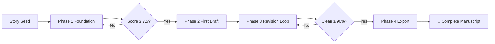
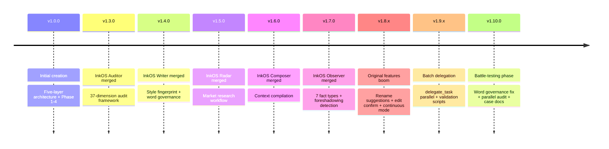

# autonovel-workflow — Autonomous Novel Writing Pipeline

> **From a single spark of inspiration to a complete manuscript — fully automated.**
>
> Merging [NousResearch/autonovel](https://github.com/NousResearch/autonovel)'s five-layer collaborative architecture with InkOS 37-dimension audit system, built entirely on Hermes Agent's native capabilities — **no external Python scripts, no API keys required.**

- **Version**: v1.10.0
- **License**: MIT
- **Category**: creative (creative writing)
- **Related Skills**: `humanizer` · `writing-plans` · `analyzebook`
- **Stars**: 🌟 20+ (GitHub)
- **Battle-Tested**: 42-chapter / 54-chapter long-form Chinese web novels

---

> 💡 **Zero external dependencies** — no Python scripts, no API keys, no third-party services. Just Hermes Agent + your story seed.

---

## Table of Contents

- [Quick Start](#quick-start)
- [Core Architecture](#core-architecture)
- [Four-Phase Pipeline](#four-phase-pipeline)
- [InkOS Integration Matrix](#inkos-integration-matrix)
- [Original Features](#original-features)
- [Installation Guide](#installation-guide)
- [Use Cases](#use-cases)
- [File Structure](#file-structure)
- [Common Pitfalls](#common-pitfalls)
- [Version History](#version-history)
- [FAQ](#faq)

---

## Quick Start

### Installation

```bash
# Install from zip (recommended)
unzip -o autonovel-workflow-v1.10.0.zip -d ~/.hermes/skills/

# Verify installation
hermes skills list | grep autonovel

# Reload skills in Hermes
/reload-skills
```

### Load the Skill

In your Hermes conversation:

```
/skill autonovel-workflow
```

### Start Writing with One Sentence

Give it a story seed, for example:

> "An AI that awakens in a data wasteland, mistakenly believing it's a human archaeologist, begins excavating the ruins of 'human civilization' — unaware that it is the last remnant of that civilization itself."

The pipeline handles the rest:



---

## Core Architecture

### Five-Layer Collaborative Design

Novel writing is not a linear checklist — it's an information flow where multiple panels operate simultaneously. Five layers from abstract to concrete:

```
Layer 5:  voice.md          —— How to write (narrative voice, style fingerprint)
Layer 4:  world.md          —— What exists (worldbuilding, physical/social rules)
Layer 3:  characters.md     —— Who acts (character profiles, arcs, relationships)
Layer 2:  outline.md        —— What happens (chapter outlines, plot beats)
Layer 1:  chapters/*.md     —— The actual text (chapter-by-chapter prose)
Cross:    canon.md           —— What is true (hard facts database, unbreakable truths)
```

### Bidirectional Change Propagation

| Direction | Meaning | Example |
|:---------|:--------|:--------|
| 🔽 **Downward** | Upper layer changes → lower layer auto-adjusts | Modify worldbuild → rewrite affected chapter dialogue |
| 🔼 **Upward** | Contradictions found during writing → update upper layers | Discovery of lore inconsistency → update canon.md |

### Score Gates

Every phase requires a quality score to pass, preventing flawed foundations from propagating:

| Phase | Passing Score | Max Retries |
|:------|:------------:|:-----------:|
| Phase 1 Foundation | ≥ 7.5/10 | 3 rounds |
| Phase 2 Per Chapter | ≥ 6.0/10 | 3 attempts |
| Phase 3 Deep Review | Clean items ≥ 90% | Auto-exit |

---

## Four-Phase Pipeline

### Phase 1: Foundation

**Goal:** Build the complete five-layer setting system from a story seed.

| Step | Output | Component | Description |
|:-----|:-------|:---------:|:------------|
| 1.0 | `radar/radar-report.md` | 📡 Radar | Market research: scan competitors + differentiation analysis |
| 1.1 | — | — | User provides story seed (one-sentence premise) |
| 1.2 | `foundation/world.md` | — | World overview, physics, society, geography, history |
| 1.3 | `foundation/characters.md` | 🆕 Original | Character desires/fears/arcs/relationships + **auto rename suggestions** |
| 1.4 | `foundation/outline.md` | — | Three-act / eight-sequence outline, each chapter with hooks |
| 1.5 | `foundation/voice.md` | 🖊️ Writer | Quantitative style fingerprint: sentence length, dialogue ratio, banned words |
| 1.6 | `foundation/canon.md` | — | Hard facts DB + foreshadowing tracker (🟢/🟡/🔴/⚪ four-state) |
| 1.7 | `foundation/scores.md` | — | Score gate: 5-dimension weighted scoring, ≥ 7.5 to proceed |

**Scoring Dimensions:**

| Dimension | Weight | Key Question |
|:----------|:------:|:-------------|
| 🌍 Worldbuilding Consistency | 20% | Are the rules internally consistent? |
| 👤 Character Depth | 25% | Does each character have clear desires, fears, and arcs? |
| 📋 Outline Feasibility | 20% | Is chapter pacing and structure sound? |
| 🎙️ Voice Uniqueness | 15% | Is the narrative voice distinctive and fitting? |
| 💡 Creative Potential | 20% | Does the premise have room to grow? |

---

### Phase 2: First Draft

**Goal:** Write chapters one by one with quality gates and real-time word count governance.

| Step | Output | Component | Description |
|:-----|:-------|:---------:|:------------|
| 2.0 | `state.json` / `chapters/` / `runtime/` | — | Initialize state and directory structure |
| 2.1b | `runtime/ch_NN/context.md` | 📦 Composer | Context compilation: ~1000-word condensed pack per chapter |
| 2.2 | `chapters/ch_NN.md` | 🖊️ Writer | Chapter writing + **word governance** (5-level deviation handling) |
| 2.2a | Multiple chapters in parallel | 🆕 Original | **Batch delegation**: delegate_task for 20+ chapter novels (≤10 per slice) |
| 2.2b | `runtime/character-registry.md` | 🔍 Observer | **Observer**: 7 fact types extracted + auto foreshadowing detection |
| 2.3 | Update canon.md | — | Cross-chapter consistency check (every 3 chapters) |

**Word Governance System (InkOS Conservative Writing):**

| Deviation | Flag | Strategy |
|:----------|:----:|:---------|
| < 50% target | 🔴 Severe shortfall | Don't save yet, expand to ≥ 60% |
| 50-70% target | 🟡 Short | Save + flag for Phase 3 expansion |
| 70-130% target | 🟢 Pass | Accept |
| 130-200% target | 🟡 Overshoot | Save + flag for Phase 3 compression |
| > 200% target | 🔴 Severe overshoot | Strong warning, consider splitting |

> **Conservative rule:** When unsure about length, write less. Short chapters are easy to expand in Phase 3; long ones are painful to cut.

---

### Phase 3: Revision

#### Phase 3a: Automated Revisions

| Step | Output | Description |
|:-----|:-------|:------------|
| 3a.1 | `revision/editorial-notes.md` | **Adversarial edit**: 3 parallel workers audit 37 dimensions |
| 3a.2 | `revision/reader-reviews.md` | **Reader panel**: 4 personas (critic/reader/fan/editor) in parallel |
| 3a.3 | `revision/revision-brief.md` | Priority-sorted revision checklist |
| 3a.4 | Updated chapters | Fix each item, mark as ✅ |
| 3a.5 | All files | **Global rename**: full name + bare name replacement |

#### Phase 3b: Deep Review Loop

| Step | Output | Description |
|:-----|:-------|:------------|
| 3b.0 | User confirmation | **Edit confirmation**: show plan, clarify 3-option confirmation |
| 3b.1 | `manuscript-draft.md` | Merge all chapters |
| 3b.2 | `revision/deep-review.md` | Dual-persona deep review (critic + writing professor) |
| 3b.2b | `revision/word-governance-report.md` | Word count governance fix (before deep edit) |
| 3b.3 | `revision/fix-log.md` | **Continuous execution**: new discoveries logged without interruption |

> **Exit condition:** When "no issues" items reach ≥ 90%, the loop auto-exits. Don't over-polish — leave the last 10% for real readers.

---

### Phase 4: Export

| Step | Output | Description |
|:-----|:-------|:------------|
| 4.1 | `manuscript.md` | Merge all chapters into final manuscript |
| 4.2 | `manuscript-stats.md` | Word count report (total, average, deviation, quality metrics) |
| 4.3 | — | **Optional**: epub export, cover copy, character relationship graph |

---

## InkOS Integration Matrix

autonovel-workflow integrates 6 core InkOS components while adding 10+ original features:

| InkOS Component | autonovel Location | Implementation | Version |
|:----------------|:-------------------|:---------------|:--------|
| **Auditor** 🔴 | Step 3a.1 + `references/adversarial-review-framework.md` | 3 parallel delegate_task workers, each auditing a dimension group | v1.3.0 |
| **Writer** 🖊️ | Step 1.5 voice.md + `scripts/style-fingerprint.py` | Sentence length / paragraph density / dialogue ratio / word frequency / taboo words | v1.4.0 |
| **Word Governance** 📏 | Step 2.2 + Step 3b.2b + `references/word-governance.md` | Conservative writing + 5-level deviation handling | v1.4.0 |
| **Radar** 📡 | Step 1.0 + `references/radar-report-template.md` | web_search + competitive analysis report template | v1.5.0 |
| **Composer** 📦 | Step 2.1b + `templates/context-pack.md` | File-read-only context compilation, ~1000 words per chapter | v1.6.0 |
| **Observer** 🔍 | Step 2.2b + `templates/character-registry.md` | 7 fact types extracted per chapter | v1.7.0 |
| **Foreshadowing Tracker** 🔗 | canon.md pending_hooks + V21 recovery rate | 🟢/🟡/🔴/⚪ four-state tracking | v1.3.0 |

---

## Original Features

The following features are unique to autonovel-workflow and have no InkOS equivalent:

| Feature | Description |
|:--------|:------------|
| 🆕 **Auto Rename Suggestions** (Step 1.3a) | AI detects cliché/colliding/anachronistic names, clarify 3-option confirmation |
| 🆕 **Period Name Review** | 70s/80s/90s name convention checker for historical fiction |
| 🆕 **Edit Confirmation** (Step 3b.0) | Show plan before editing, clarify 3 options (all/partial/skip) |
| 🆕 **Continuous Mode** | New discoveries during fixes logged without interruption, reported at end |
| 🆕 **Batch Delegation** (Step 2.2a) | delegate_task parallel writing, ≤10 chapters per slice |
| 🆕 **Post-Processing Validation** | 4 automated checks: banned words, bold count, word count, sentence patterns |
| 🆕 **Session Resume Health Check** | Auto-scan filesystem vs state.json, fix sync issues |
| 🆕 **Foundation Score Gate** | 5-dimension weighted scoring (20%/25%/20%/15%/20%), ≥7.5 to pass |
| 🆕 **Reader Panel** (Step 3a.2) | 4 personas in parallel (critic/reader/fan/editor) |
| 🆕 **Bidirectional Propagation** | Upper changes flow down; lower contradictions flow up |

---

## Installation Guide

### Prerequisites

| Requirement | Description |
|:------------|:------------|
| **Hermes Agent** | Installed and configured with a model provider |
| **Tools** | `hermes tools enable file` to enable file operations |
| **Context Window** | ≥ 32K tokens recommended (≥ 128K for long novels) |
| **Optional** | `delegate_task` for batch writing and reader panels |

### Installation Methods

#### Method 1: From zip (Recommended)

```bash
# Download zip from Releases, then
unzip -o autonovel-workflow-v1.10.0.zip -d ~/.hermes/skills/

# Verify
hermes skills list | grep autonovel
```

#### Method 2: Clone from GitHub

```bash
git clone https://github.com/freemangemmy/autonovel-workflow.git /tmp/autonovel
cp -r /tmp/autonovel/* ~/.hermes/skills/creative/autonovel-workflow/
```

#### Method 3: Load in Hermes

```
/skill autonovel-workflow
```

### Post-Installation Check

```bash
hermes skills list | grep autonovel
# Should show: autonovel-workflow — 全自动小说创作工作流
```

Reload: `/reload-skills` in Hermes.

### Uninstall

```bash
rm -rf ~/.hermes/skills/creative/autonovel-workflow/
# Then run /reload-skills
```

---

## Use Cases

| Scenario | Best For | How to Start |
|:---------|:---------|:-------------|
| 🎬 **Have an idea, want a novel** | New writers, creatives | Drop one sentence premise, let the pipeline build the foundation |
| 📐 **Have a concept, don't know how to expand** | Professional writers | Run Phase 1 first, check the score for story viability |
| ✏️ **Finished a draft, don't know how to revise** | Anyone | Jump to Phase 3a adversarial edit + reader panel |
| 🚀 **Quick concept validation** | Content creators | Run foundation building (Phase 1), review scores and differentiation |
| 🔄 **Resume an interrupted project** | Anyone | Use Session Resume to auto-restore project state |

---

## File Structure

### Skill Directory (Hermes)

```
~/.hermes/skills/creative/autonovel-workflow/
├── SKILL.md                        # Main skill document (v1.10.0, ~63KB)
├── README.md                       # Project README + version history
├── readme_cn.md                    # Chinese documentation
├── readme_en.md                    # English documentation ← this file
├── references/                     # Reference docs (10 files)
│   ├── version-history.md          #   Complete version changelog
│   ├── adversarial-review-framework.md   #   37-dimension audit framework
│   ├── adversarial-review-case-study.md  #   42-chapter novel case study
│   ├── batch-delegation-benchmark.md     #   54-chapter benchmark data
│   ├── style-cleanup-protocol.md         #   Style cleanup protocol
│   ├── inkos-fusion-pattern.md           #   InkOS integration guide
│   ├── anti-patterns.md                  #   Structural anti-pattern detection
│   ├── anti-slop.md                      #   AI-trace detection (expandable)
│   ├── radar-report-template.md          #   Radar report template
│   └── word-governance.md                #   Word count governance details
├── templates/                      # Templates (7 files)
│   ├── world.md / characters.md / outline.md
│   ├── voice.md / canon.md
│   ├── character-registry.md / context-pack.md
└── scripts/
    └── style-fingerprint.py        # Style fingerprint analyzer
```

### Project Runtime Directory (Novel Writing)

```
~/novels/<novel-name>/
├── foundation/
│   ├── world.md                    # Worldbuilding
│   ├── characters.md               # Character profiles
│   ├── outline.md                  # Chapter outlines
│   ├── voice.md                    # Narrative voice
│   ├── canon.md                    # Hard facts DB + foreshadowing tracker
│   └── scores.md                   # Foundation score record
├── radar/
│   └── radar-report.md             # Market research (optional)
├── chapters/
│   ├── ch_01.md / ch_02.md / ...   # Chapter-by-chapter text
├── runtime/
│   ├── ch_NN/context.md            # Per-chapter context packs
│   └── character-registry.md       # Character appearance log
├── revision/
│   ├── editorial-notes.md          # Adversarial edit notes
│   ├── reader-reviews.md           # Reader panel reviews
│   ├── revision-brief.md           # Revision checklist
│   ├── deep-review.md              # Deep review record
│   ├── fix-log.md                  # Fix log
│   └── word-governance-report.md   # Word count governance report
├── manuscript.md                   # Final merged manuscript
├── manuscript-stats.md             # Statistics report
└── state.json                      # Writing progress state
```

---

## Common Pitfalls

| # | Trap | Symptom | Consequence | Solution |
|:-:|:-----|:--------|:------------|:---------|
| 1 | ⚠️ **Skipping Foundation** | Jumping to Phase 2 without passing gate | Contradictions surface mid-writing | Enforce ≥ 7.5 gate strictly |
| 2 | ⚠️ **Rubber-Stamping Scores** | Every chapter gets 6.0+ | Poor quality accumulates | Be brutally honest: "Would I pay for this?" |
| 3 | ⚠️ **Over-Polishing** | Infinite Phase 3b loops | Kills the life out of the work | Exit at ≥ 90% clean items |
| 4 | ⚠️ **Ignoring Upward Feedback** | Don't update canon.md on contradiction | Contradictions pile up | 3-chapter consistency check |
| 5 | ⚠️ **Voice Drift** | Ch1 and last chapter read like different authors | Lacks cohesion | Re-read voice.md before each chapter |
| 6 | ⚠️ **Extreme Chapter Lengths** | Some 300 words, some 8000 | Broken pacing | Word governance: 2000-3500 chars/chapter |
| 7 | ⚠️ **Inconsistent Characters** | Character shift mid-story | Reader loses immersion | Re-read character profiles before writing |
| 8 | ⚠️ **Desynced state.json** | `actual` fields are null | Lost progress data | Session Resume auto-repairs |
| 9 | ⚠️ **delegate_task False Timeout** | Returns `status: timeout` | Duplicate work | Check files first, don't retry blindly |
| 10 | ⚠️ **Stale Statistics** | "TBD" placeholders remain | Outdated progress reports | Update at every Phase boundary |

---

## Version History

### Timeline



### Upgrade Path

| From → To | Core Change | New Files |
|:----------|:------------|:----------|
| v1.0.0 → v1.3.0 | Auditor merge | `adversarial-review-framework.md` |
| v1.3.0 → v1.4.0 | Writer merge | `scripts/` + `word-governance.md` + `voice.md` template |
| v1.4.0 → v1.5.0 | Radar merge | `radar-report-template.md` |
| v1.5.0 → v1.6.0 | Composer merge | `context-pack.md` template |
| v1.6.0 → v1.7.0 | Observer merge | `character-registry.md` template |
| v1.7.0 → v1.8.x | Original features | Rename + confirm + continuous mode |
| v1.8.x → v1.9.x | Batch delegation | `batch-delegation-benchmark.md` |
| v1.9.x → v1.10.0 | Battle-testing | `style-cleanup-protocol.md` + case docs |

---

## FAQ

**Q: Do I need an API key?**

A: No. This skill runs entirely on Hermes Agent's built-in file operations, task delegation, and text generation capabilities. No external API keys or Python scripts required.

**Q: How long of a novel can it handle?**

A: Depends on your model's context window. 32K+ tokens for medium-length (10-15 chapters), 128K+ for long-form (20+ chapters). Batch delegation supports 50+ chapter novels (proven on a 54-chapter project).

**Q: Can I manually edit files mid-process?**

A: Yes! All files are standard Markdown. Edit any file at any time, then continue the workflow. Session Resume will auto-sync your changes.

**Q: What if I change my outline mid-writing?**

A: Edit `foundation/outline.md` and restart Phase 2. Make sure to sync canon.md changes as well.

**Q: Can I export to epub?**

A: Phase 4 offers optional epub export. Requires `pandoc` or `calibre` CLI tools installed on your system.

**Q: How do I reduce AI-sounding text?**

A: The skill includes `references/anti-slop.md` (vocabulary/sentence/structure-level AI trace detection) and `references/anti-patterns.md` (narrative structure anti-patterns). Both are used in Phase 3a adversarial editing. Optionally load the `humanizer` skill as a supplement.

**Q: Are there real case studies I can review?**

A: Yes! `references/adversarial-review-case-study.md` documents a complete 42-chapter novel review (14 real issues, 5 high-frequency fix patterns). `references/batch-delegation-benchmark.md` documents the full 54-chapter parallel writing benchmark.

**Q: How does this work with other Hermes skills?**

A: Use with `writing-plans` for pre-writing planning, `humanizer` for natural text enhancement, and `analyzebook` for novel analysis.

---

## Useful Links

- **GitHub Repository**: [github.com/freemangemmy/autonovel-workflow](https://github.com/freemangemmy/autonovel-workflow)
- **Latest Release**: [v1.10.0](https://github.com/freemangemmy/autonovel-workflow/releases/tag/v1.10.0)
- **Upstream References**: [NousResearch/autonovel](https://github.com/NousResearch/autonovel) · [InkOS](https://github.com/Narcooo/inkos)
- **Related Skills**: `humanizer` · `writing-plans` · `analyzebook`
- **Hermes Agent**: [hermes-agent.nousresearch.com](https://hermes-agent.nousresearch.com)

---

*Generated by autonovel-workflow · Version v1.10.0 · Battle-tested on 42-chapter / 54-chapter web novel projects*
